# Single Inverted Pendulum

Physical inverted-pendulum platform designed and built from scratch for experimentation with embedded control, state estimation and data-driven control methods.

> **Project status:** the physical platform is operational. LQR balancing, state estimation and swing-up v1 are working on the real system. Mechanical refinement, energy-based swing-up and learning-based control are the next development stages.

<p align="center">
  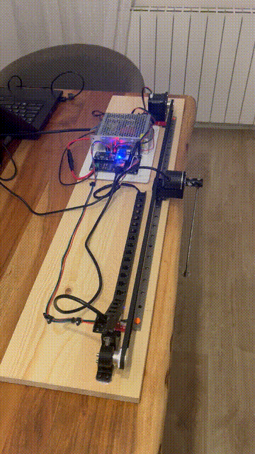
</p>

<p align="center"><em>Swing-up v1 on the physical platform, followed by automatic capture by the LQR controller.</em></p>

## Overview

This repository contains the development of a real cart-pole inverted pendulum, including electronics, custom PCB, embedded firmware, control design, experiment tooling and mechanical integration.

The project is used as a practical control platform rather than only as a simulation exercise. The main interest is in what changes when the controller is deployed on real hardware: finite rail travel, friction and stiction, sensor limitations, mechanical tolerances, actuator constraints and controller transitions.

<p align="center">
  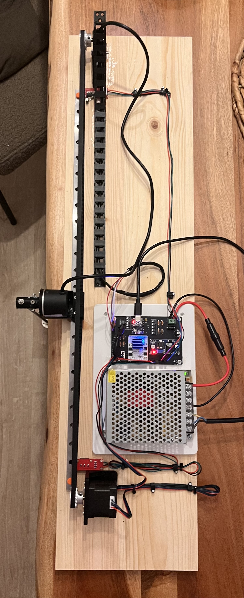
</p>

### Current capabilities

- Physical cart-pole system built and operational
- Custom control electronics and PCB designed in KiCad
- PCB manufactured and assembled for the project
- ESP32-C3 embedded controller
- Stepper motor actuation through TMC5160
- Pendulum angle measurement using a quadrature encoder
- Automatic cart homing
- Linearized state-space model
- Discrete state observer
- LQR upright stabilization
- Swing-up v1 with automatic transition to LQR
- Rail-limit handling during swing-up and balancing
- Python GUI, serial telemetry and experiment logging

Current work:

- Pivot and encoder mechanics
- Transmission tensioning
- Energy-based swing-up
- Data-driven control experiments

## System architecture

The current system is divided into four main layers:

```text
Physical pendulum / cart
        │
        ▼
Sensors + actuator
Encoder + NEMA17 / TMC5160
        │
        ▼
ESP32-C3
Homing · State estimation · Swing-up · LQR · Safety
        │
        ▼
Serial telemetry
        │
        ▼
Python experiment tool
Visualization · Commands · Logging · Analysis
```

The control loop runs on the ESP32. The Python application is used as the supervisory and experiment interface rather than as part of the real-time controller.

## Hardware

This is a fully built physical system, not a software-only project.

The hardware development includes:

- component selection;
- ESP32-C3 control electronics;
- TMC5160 stepper motor driver;
- NEMA17 actuator;
- pendulum encoder interface;
- 24 V power system and DC conversion;
- end-stop integration for cart homing;
- custom schematic and PCB design;
- custom KiCad symbols and footprints;
- PCB routing and manufacturing files;
- PCB fabrication and assembly;
- wiring and full-system integration;
- mechanical cart and pendulum assembly.

The complete KiCad project, Gerbers and BOM-related files are available in [`PCB/`](PCB/).

### Custom PCB

The controller PCB was designed specifically for the platform and manufactured from the KiCad design files included in this repository.

<table>
<tr>
<td width="50%" align="center">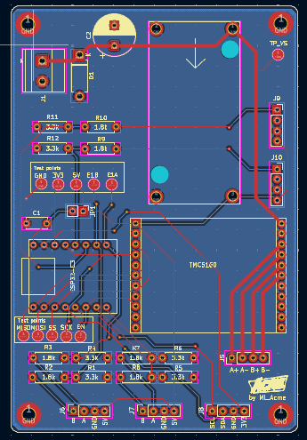<br><em>PCB layout in KiCad</em></td>
<td width="50%" align="center">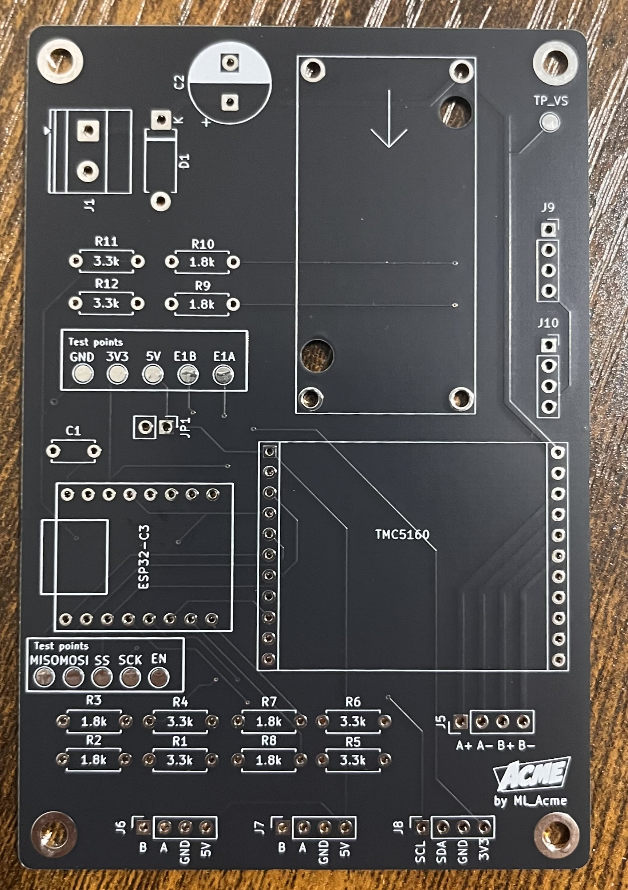<br><em>Fabricated PCB</em></td>
</tr>
</table>

The schematic and both sides of the fabricated board are preserved in [`docs/assets/images/pcb/`](docs/assets/images/pcb/), while the editable design and manufacturing files remain in [`PCB/`](PCB/).

### Mechanical prototype

The current mechanical platform is a first functional prototype. It is good enough to validate the control architecture, but it also makes the next mechanical tasks clear: reducing pivot friction, improving encoder coupling, adding a better transmission tensioning solution and improving repeatability.

<table>
<tr>
<td width="33%" align="center">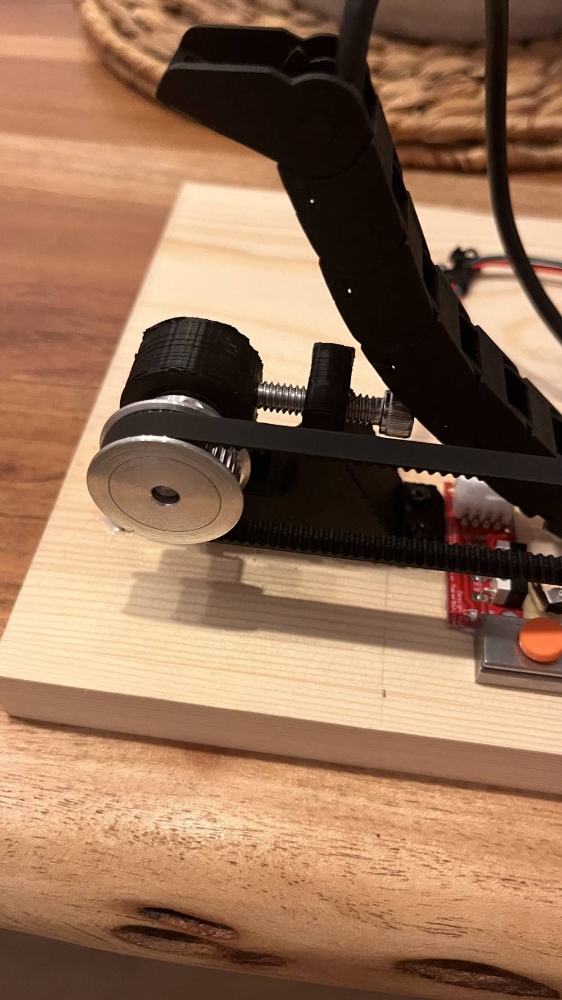<br><em>Pivot detail</em></td>
<td width="33%" align="center">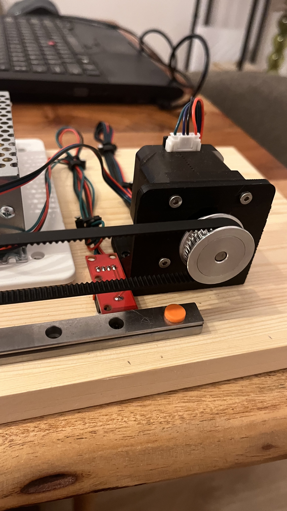<br><em>Motor and transmission</em></td>
<td width="33%" align="center">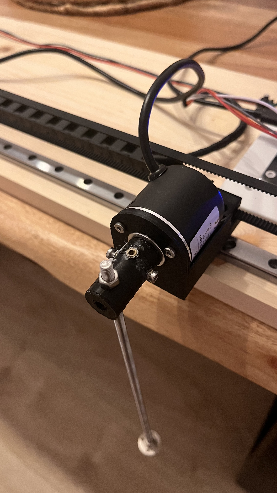<br><em>Encoder detail</em></td>
</tr>
</table>

## Control architecture

The embedded controller combines different control modes around a common state-machine architecture.

### LQR balancing

Around the upright equilibrium, the system uses a linearized model with the state vector

\[
x = [\theta,\; \dot{\theta},\; x,\; \dot{x}]^T
\]

and an LQR state-feedback law.

The measured pendulum angle and cart position are combined with a discrete observer to estimate the state variables required by the controller.

<p align="center">
  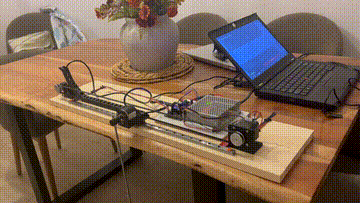
</p>

Detailed mathematical derivations are kept outside this README. The current control notes are available in [`Documentation/apuntes_pendulo_invertido_LQR.md`](Documentation/apuntes_pendulo_invertido_LQR.md).

### Swing-up v1

The first swing-up implementation is complete and working on the physical system.

The current version is based on a **bang-bang switching strategy**, which is sufficient to drive the pendulum from the downward position into the LQR capture region. The controller also includes braking logic based on the available rail distance and automatically transitions to the LQR stabilizer once the pendulum enters the capture region with sufficiently low angular velocity.

The inverse transition is also implemented: if the pendulum leaves the LQR operating region, the controller can return to swing-up mode.

The next iteration will incorporate the **pendulum energy** to improve robustness, phase independence and rail usage.

## Real-world engineering issues

The physical system has exposed several limitations that are being investigated as part of the development process:

- **Pivot friction and stiction.** Small friction around the upright equilibrium can produce a limit-cycle-like behaviour and reduce repeatability.
- **Finite cart travel.** Swing-up strategies must explicitly account for the limited rail length rather than assuming unlimited cart motion.
- **Initial-condition sensitivity.** The current swing-up works from the intended experiment start condition but is not yet phase-independent; this is one of the reasons for moving to energy-based control.
- **Mechanical precision.** Pivot geometry, encoder coupling and zero-position repeatability directly affect control performance.
- **Transmission tensioning.** The current transmission will be refined with a dedicated tensioning solution.
- **Actuator constraints.** Acceleration, speed and stopping distance have to be included in the real controller logic.
- **Controller transitions.** Moving reliably between swing-up and LQR requires explicit angle and angular-velocity capture conditions.

These points will be revisited as the mechanics and control strategy evolve.

## Experimental results

The control laws are tested on the physical platform rather than validated only in simulation. Current recorded experiments include pendulum angle and angular velocity, cart position and velocity, control action, controller mode and system state.

### Pendulum response

<p align="center">
  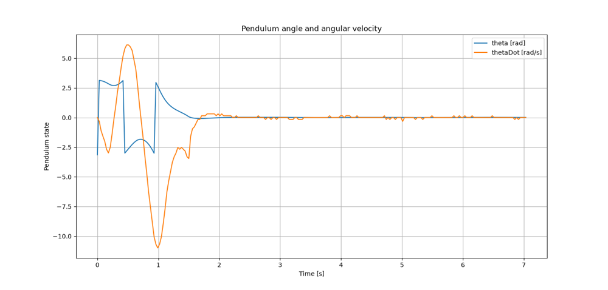
</p>

### Cart motion

<p align="center">
  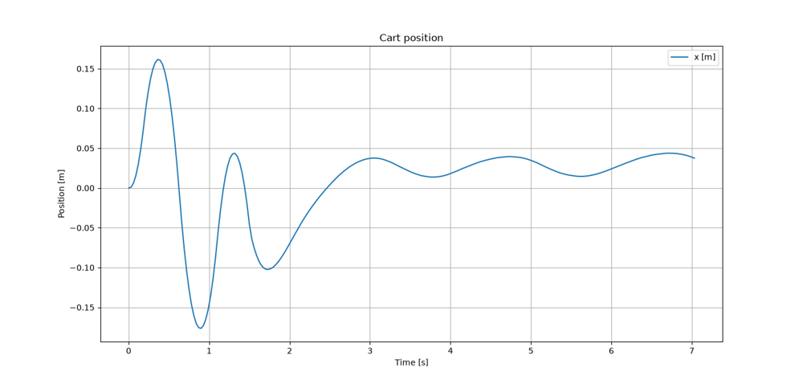
</p>

### Control action

<p align="center">
  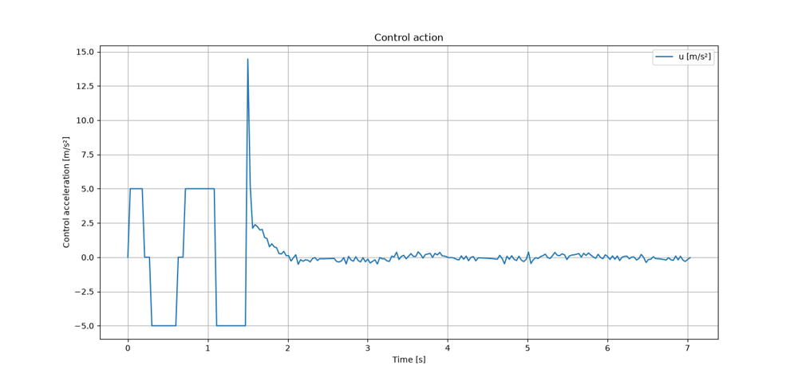
</p>

The main README only shows a compact selection of plots. More detailed experiment reports will use a consistent structure: **Objective → Hypothesis → Setup → Method → Results → Discussion → Conclusion → Next step**.

## Experiment and telemetry tooling

A Python application is used to interact with the embedded controller and capture experiments.

<p align="center">
  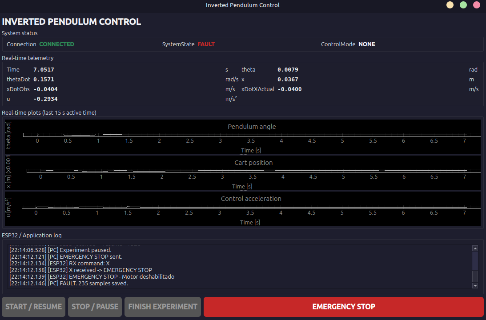
</p>

The current toolset includes:

- serial communication with the ESP32;
- start, stop and emergency-stop commands;
- real-time visualization;
- experiment logging;
- telemetry parsing;
- storage of measured signals for later analysis.

The application lives in [`Python/`](Python/).

The plan is to keep evolving it into a lightweight experiment scope where adding a new telemetry signal requires minimal changes on the Python side.

## Repository structure

```text
.
├── ESP32/          Embedded firmware and real-time control
├── Python/         Telemetry, GUI and experiment tools
├── Octave/         Control design and LQR tuning scripts
├── PCB/            KiCad project, custom libraries and fabrication files
├── Documentation/  Mathematical and technical notes
├── docs/assets/     Public-facing images, plots and animations
└── README.md
```

The source-code structure is being kept largely intact. Public-facing documentation will be added as the experiments and design iterations mature.

## Development roadmap

### Current platform

- [x] Build the first physical cart-pole platform
- [x] Design and manufacture custom electronics
- [x] Implement homing and embedded system state machine
- [x] Develop the linear model and LQR controller
- [x] Implement state estimation
- [x] Validate upright balancing on real hardware
- [x] Implement swing-up v1 based on bang-bang control
- [ ] Improve pivot mechanics and reduce stiction
- [ ] Improve encoder coupling and zero repeatability
- [ ] Add/improve mechanical transmission tensioning
- [ ] Develop and validate energy-based swing-up using pendulum energy
- [ ] Improve recovery from arbitrary pendulum phase
- [ ] Formalize experimental test documentation

### Data-driven control

- [ ] Build datasets from real experiments
- [ ] Train a neural network to imitate the LQR controller
- [ ] Compare neural-network and LQR behaviour on recorded data
- [ ] Investigate hybrid LQR + neural-network control
- [ ] Explore residual learning
- [ ] Explore reinforcement learning on the platform

### Future platforms

- [ ] Double inverted pendulum
- [ ] More mechanically refined cart-pole versions
- [ ] Additional unstable control benchmarks
- [ ] Experimental platforms combining advanced control, embedded systems and machine learning

## Documentation approach

The repository will evolve together with the hardware. Experimental results, mechanical limitations and redesign decisions will be documented alongside the controller implementations.

The development path is kept visible: **model → design → implementation → experiment → problem → diagnosis → improvement**.
